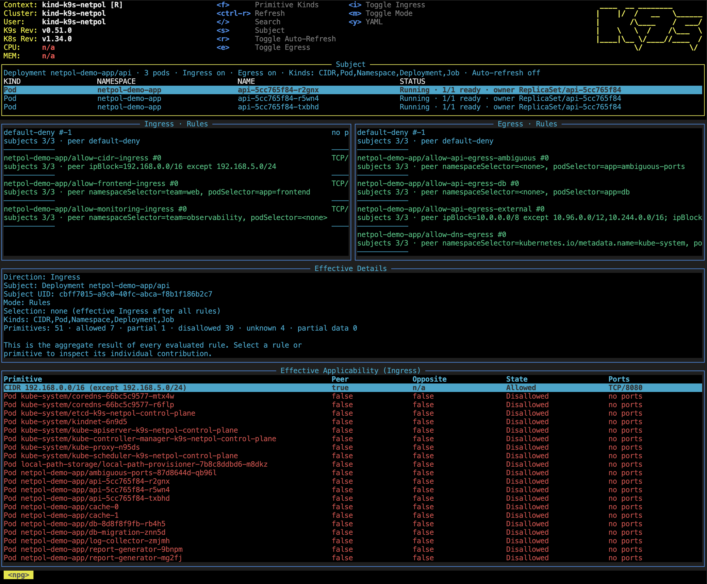
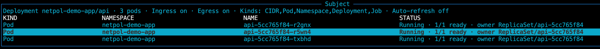

# Network Policy Graph (NPG) Read-Only Panel

This document describes only the Network Policy Graph (NPG) read-only panel in
K9s.


## 1. What Is Network Policy Graph?

Network Policy Graph is a read-only reachability view for standard Kubernetes
`networking.k8s.io/v1` `NetworkPolicy` resources. It explains how NetworkPolicy
affects traffic to and from a selected workload, called the **subject**.

NPG is intended to answer questions such as:

- Which ingress sources can reach this workload?
- Which egress destinations can this workload reach?
- Which NetworkPolicy rule contributes to an allow decision?
- Does the policy on the other endpoint also permit the traffic?
- Which ports and protocols remain after both endpoints are evaluated?
- Is a result fully allowed, fully disallowed, only partially allowed, unknown,
  or based on incomplete data?

NPG evaluates concrete pod-to-pod paths. For a path to be allowed:

1. The source pod's egress policy must allow it.
2. The destination pod's ingress policy must allow it.
3. The two sides must allow at least one common protocol and destination port.

NetworkPolicy rules are additive allow rules; they are not explicit deny rules.
A disallowed result normally means that a pod is isolated in that direction and
no matching allow rule permits the peer and port.

NPG can be opened with:

```text
:netpolgraph <kind> <name> [namespace]
:npgraph <kind> <name> [namespace]
:npg <kind> <name> [namespace]
```

Supported subject kinds are `Pod`, `Deployment`, `Job`, and `Namespace`. Common
aliases such as `po`, `deploy`, `jobs`, and `ns` are accepted. Examples:

```text
:npg pod api-7d8c9f default
:npg deployment api default
:npg job database-migration default
:npg namespace payments
```

The same panel can be opened from a selected Pod, Deployment, Job, or Namespace
by pressing `Shift-R`.

The panel does not edit, create, or delete NetworkPolicies. It evaluates the
current cluster snapshot and provides navigation to related resources and YAML.
Opening a resource leaves NPG and pushes the resource view onto the normal K9s
breadcrumb stack.

NPG evaluates reachability once when opened. Automatic refresh is disabled by
default. It can be enabled at a five-second interval with `r`, or reevaluated
once with `Ctrl-R`.

NPG models the standard Kubernetes NetworkPolicy API, not guaranteed packet
delivery. CNI behavior, NAT, `hostNetwork`, node-local traffic, service meshes,
cloud firewalls, vendor-specific policies, application authorization, and
other networking layers may change the real result.

## 2. Terminology

### Subject

The **subject** is the Kubernetes resource whose reachability is being
investigated.

| Subject kind | Pods evaluated by NPG |
|---|---|
| `Pod` | The selected pod. |
| `Deployment` | The deployment's current pods. |
| `Job` | The job's current pods. |
| `Namespace` | The pods in the selected namespace. |

Deployment, Job, and Namespace subjects are aggregates. Their result can
therefore include many pod pairs rather than a single connection.

### Subject kind and primitive kind

NPG uses the word **kind** in two related places:

- A **subject kind** identifies what is being investigated: Pod, Deployment,
  Job, or Namespace.
- A **primitive kind** identifies the peer-side result shown in direction and
  applicability panels: CIDR, Pod, Namespace, Deployment, or Job.

The primitive-kind filter is global to the NPG view. It affects both directions
and their applicability tables, but it does not change the subject.

### Primitive

A **primitive** is a peer-side reachability target or source:

| Primitive kind | Meaning |
|---|---|
| `CIDR` | An `ipBlock.cidr`, including any `except` ranges. |
| `Pod` | One concrete pod. |
| `Namespace` | A conservative aggregate of pods in a namespace. |
| `Deployment` | A conservative aggregate of the deployment's pods. |
| `Job` | A conservative aggregate of the job's pods. |

For aggregate primitives, `Allowed` means every evaluated concrete pod pair is
allowed. A mix of allowed and non-allowed pairs is `Partial`, not `Allowed`.

### Pod pair

A **pod pair** is one concrete source pod and destination pod combination.

- For ingress, the peer pod is the source and the subject pod is the
  destination.
- For egress, the subject pod is the source and the peer pod is the
  destination.

Pair counts are important for aggregate subjects and primitives. For example,
two subject pods evaluated against three peer pods can produce six pairs.

### Ingress

**Ingress** is traffic entering the subject. The subject is the destination and
the displayed primitive is the source.

An ingress rule:

- selects destination pods through the NetworkPolicy's `podSelector`;
- matches sources through the rule's `from` peers;
- allows the rule's destination ports.

End-to-end ingress reachability also requires the source pod's egress side to
allow compatible traffic.

### Egress

**Egress** is traffic leaving the subject. The subject is the source and the
displayed primitive is the destination.

An egress rule:

- selects source pods through the NetworkPolicy's `podSelector`;
- matches destinations through the rule's `to` peers;
- allows the rule's destination ports.

End-to-end egress reachability also requires the destination pod's ingress side
to allow compatible traffic.

### NetworkPolicy rules

A NetworkPolicy rule is one entry in `spec.ingress` or `spec.egress`. NPG
identifies a real rule by:

- policy namespace and name;
- direction;
- zero-based rule index.

Rules can match peers with:

- `podSelector`;
- `namespaceSelector`;
- both selectors, which form an intersection;
- `ipBlock`, including `except` ranges;
- an omitted peer list, which means all peers.

An omitted port list allows all ports for the protocols represented by the
evaluation. Named ports are resolved against destination pod container ports
when possible. Ambiguous named ports are reported as unknown rather than being
treated as allowed.

NPG can also display synthetic rules:

- **unrestricted**: no NetworkPolicy isolates the pod in that direction;
- **default-deny**: a policy isolates the pod, but no additive allow rule
  permits the evaluated peer and port.

Synthetic rules explain evaluated behavior but do not correspond to a
Kubernetes object.

### Peer

In the Kubernetes API, a **peer** is the opposite endpoint matched by a rule's
`from` or `to` entry.

In the NPG applicability table, **Peer** is an NPG-specific boolean:

- `true` means the selected rule, or at least one rule in the current direction
  for an effective table, matched the primitive for at least one concrete pair;
- `false` means no such current-direction peer match was found;
- `n/a` means no concrete pair existed, so peer matching was not evaluated.

`Peer=true` does not by itself mean that traffic is allowed. The opposite
endpoint and port intersection must also permit the traffic.

### Opposite

**Opposite** is an NPG-specific concept; it is not a Kubernetes NetworkPolicy
field.

- For an ingress row, the opposite side is the source pod's egress policy.
- For an egress row, the opposite side is the destination pod's ingress policy.

The applicability table aggregates this check conservatively:

- `true` means all concrete pairs represented by the row are effective through
  the selected/current-direction match and the opposite endpoint permits
  compatible traffic;
- `false` means at least one pair lacks a required match, opposite-side allow,
  or common protocol/port;
- `n/a` is shown for CIDRs because an address range is not modeled as a pod with
  an opposite NetworkPolicy side;
- `n/a` is also shown when no concrete pair exists.

Always interpret `Peer`, `Opposite`, and `State` together. For example,
`Peer=true`, `Opposite=false`, and `State=Disallowed` means that the selected
side matched, but the complete end-to-end path was not allowed.

### Permissions and ports

Displayed permissions use values such as:

- `TCP/all`, `UDP/all`, or `SCTP/all`;
- `TCP/443`;
- `TCP/8000-8100`;
- `TCP/http` for a named port that has not been resolved in that context;
- `unknown` when the exact port cannot be safely determined;
- `no ports` when there is no effective permission;
- `n/a` when no concrete pair was evaluated.

For pod-to-pod traffic, effective permissions are the intersection of the
source egress and destination ingress permissions.

## 3. Panels

NPG initially shows the Subject panel, both direction panels, and the Details
area. Both directions initially use Rules mode, all primitive kinds are
enabled, and focus starts on Subject.

### Subject panel

  The Subject panel identifies the selected subject and lists associated
workloads.

Its summary line contains:

- subject kind and namespace/name;
- number of subject pods;
- whether ingress and egress are visible;
- enabled primitive kinds;
- auto-refresh state;
- truncation, partial-data, loading, and error messages when present.

The workload table is sorted by namespace and name and is limited to 300 rows.
Pod, Deployment, and Job subjects list their resolved pods. Namespace subjects
can list Deployments, ReplicaSets, StatefulSets, DaemonSets, Jobs, and Pods.

| Column | Meaning | Possible values |
|---|---|---|
| `KIND` | Workload resource kind. | `Pod`, `Deployment`, `ReplicaSet`, `StatefulSet`, `DaemonSet`, or `Job`. |
| `NAMESPACE` | Namespace containing the workload. | A Kubernetes namespace name. |
| `NAME` | Workload resource name. | A Kubernetes resource name. |
| `STATUS` | Compact workload-specific status. | Pod phase and readiness, owner information, ready/desired replicas, job condition, or completed count. |

Press `y` while a workload row is selected to open that workload's YAML.

### Ingress and Egress panels

Ingress and Egress use the same layout and behavior but represent opposite
traffic directions. Press `m` to switch both panels between Rules and
Primitives mode. The mode is always shared, while filters, selections, and
scroll positions are preserved independently for each direction and mode.

The panel title shows:

```text
<Direction> · <Rules|Primitives> · filter: <text>
```

The filter suffix is shown only when that direction and mode has an active text
filter.

#### Rules mode

Rules are rendered as two-line blocks without a header.

| Displayed field | Meaning | Possible values |
|---|---|---|
| Rule identity | Policy namespace/name and zero-based rule index. Synthetic rows use their synthetic name and index `-1`. | `payments/allow-api #0`, `default-deny #-1`, `unrestricted #-1`. |
| Ports | Permissions contributed by the rule. | Protocol/all, numeric ports, ranges, named or unknown ports, or `no ports`. |
| `subjects matched/selected` | Number of subject pods for which the rule contributed evidence divided by the number selected by the policy for that direction. | For example, `subjects 2/3`. |
| `peer` | Compact summary of the rule's peer selectors. | `all peers`, selector text, CIDR text, `default-deny`, or `unrestricted`. |

Rules do not use a separate visible state column. The row color carries the
state, and the full state is shown in Rule Details.

| Rule state | Meaning |
|---|---|
| `Allowed` | The rule matched all subject pods selected by that rule. |
| `Partial` | The rule matched some, but not all, selected subject pods. |
| `Partial Data` | Warnings indicate that the result was built from incomplete data. |
| `[EMPTY]` | No subject pod was available or no selected subject pod matched the rule. Non-synthetic empty rules are hidden; synthetic explanation rows remain visible. |

Synthetic rows use the normal foreground color instead of an allow/deny color
because they are explanations, not real NetworkPolicy rules.

When a real rule is selected and the direction panel has focus:

- `o` opens the NetworkPolicy resource;
- `y` opens its YAML.

These actions are unavailable for synthetic rules.

#### Primitives mode

Primitives are rendered as two-line blocks with three columns.

| Column or field | Meaning | Possible values |
|---|---|---|
| State | Aggregate reachability state. | `Allowed`, `Disallowed`, `[PARTIAL allowed/total]`, `Unknown`, or `Partial Data`. |
| Primitive | Primitive kind and identity. | CIDR, Pod, Namespace, Deployment, or Job plus its name or CIDR. |
| Ports | Effective protocol and destination-port permissions. | Protocol/all, numeric ports, ranges, named or unknown ports, or `no ports`. |
| `pairs allowed/total` | Number of definitely allowed concrete pairs divided by all evaluated pairs. | For example, `pairs 3/4`. |
| Explanation | Reason for the aggregate state. | Examples include all pairs allowed, no matching allow rule, no concrete pairs, or incomplete data. |

Primitive states mean:

| State | Meaning |
|---|---|
| `Allowed` | Every concrete pair is allowed. |
| `Disallowed` | Every concrete pair is disallowed. |
| `Partial` | The result is mixed; at least one pair is allowed and at least one is not definitely allowed. |
| `Unknown` | No definitive allow/deny result can be produced. This commonly occurs when there are no current pods to form a pair, or every pair depends on unresolved semantics such as an ambiguous named port. |
| `Partial Data` | The cluster snapshot or pair evaluation is incomplete, so the displayed observations must not be treated as a complete result. |

Press `Enter` to move from the direction panel to Primitive Details. Press
`Enter` again to open Pod, Namespace, Deployment, or Job primitives. CIDRs are
address ranges rather than Kubernetes resources and cannot be opened.

### Details panel

The Details panel follows the active direction and current selection.

#### Rule Details

When a rule is selected in Rules mode, Rule Details contains:

- direction and subject identity;
- policy namespace, name, and UID;
- zero-based rule index;
- rule state;
- policy pod selector;
- matched/selected subject counts;
- each peer selector or IP block;
- ports;
- rendered rule YAML;
- contributing evidence;
- warnings.

An Applicability panel is displayed below the rule text.

#### Primitive Details

When a primitive is selected in Primitives mode, Primitive Details contains:

- direction and subject identity;
- primitive kind, identity, and UID where applicable;
- state;
- allowed/total pair coverage;
- effective ports;
- explanation;
- policy evidence;
- warnings;
- individual source-to-destination pair decisions.

A selected primitive has no per-rule applicability table.

#### Effective Details

Pressing `Esc` to clear the active direction's selection changes the Details
area to Effective Details. This is the final reachability of every enabled
primitive after all rules have been combined, rather than one selected rule's
contribution.

Effective Details shows:

- direction;
- current Rules or Primitives mode;
- `Selection: none`;
- enabled primitive kinds;
- total primitive count;
- counts for Allowed, Partial, Disallowed, Unknown, and Partial Data.

The state counts always add up to the displayed primitive total. Effective
Applicability is shown below the text when applicable.

### Applicability panel

Applicability explains how a selected rule contributes to each enabled
primitive. When no direction row is selected, **Effective Applicability**
instead shows the final result after all rules have been applied.

| Column | Meaning | Possible values |
|---|---|---|
| `Primitive` | Peer-side primitive being evaluated. | CIDR, Pod, Namespace, Deployment, or Job. |
| `Peer` | Whether the current-direction rule or effective rule set matched the primitive. | `true`, `false`, or `n/a`. |
| `Opposite` | Whether all represented paths also pass the opposite endpoint's policy and compatible-port check. | `true`, `false`, or `n/a`. CIDRs always use `n/a`. |
| `State` | End-to-end applicability state for the row. | `Allowed`, `Disallowed`, `Partial`, `Unknown`, or `Partial Data`. |
| `Ports` | Effective common protocol and destination ports. | Protocol/all, numbers, ranges, `unknown`, `no ports`, or `n/a`. |

For a selected rule, State is derived conservatively:

- `Allowed`: every concrete pair matched the selected rule and is effective
  end to end;
- `Partial`: at least one concrete pair is effective through the rule, but not
  every pair;
- `Disallowed`: no concrete pair is definitely effective through the selected
  rule;
- `Unknown`: no concrete pod pair exists, so the rule's effect cannot be
  evaluated;
- `Partial Data`: the primitive was evaluated from incomplete or truncated
  data.

For Effective Applicability, State is the primitive's final aggregate state
after all current-direction and opposite-direction rules are combined.

An `Unknown` row is not the same as a denied row. For example, a Deployment
primitive with no current pods produces zero concrete pairs. Because no peer
selector, opposite endpoint, or port intersection was actually tested, the row
uses:

```text
Peer: n/a
Opposite: n/a
State: Unknown
Ports: n/a
```

Effective applicability can also be `Unknown` when concrete pairs exist but
all of their decisions are unknown, such as when a named destination port is
ambiguous. `Partial Data` is different: it means the evaluator knows the
snapshot is incomplete, for example because of missing RBAC access, a failed
resource list/watch, or result truncation.

The panel uses the globally enabled primitive kinds. Pressing `f` can therefore
add or remove rows from both the direction panels and applicability tables.
Pressing `a` in Rules mode toggles both ingress and egress rule/effective
applicability tables between all rows and exact Allowed rows only. Disallowed,
Partial, Unknown, and Partial Data rows are hidden. The Allowed-only setting
persists across projection changes and applies again when returning to Rules.
While active, applicability titles append a second parenthesized suffix
`(Allowed only)`, for example `Applicability (Ingress) (Allowed only)`.

## 4. Navigation and Shortcuts

### Opening NPG

| Key or command | Action |
|---|---|
| `Shift-R` | Open NPG for the selected Pod, Deployment, Job, or Namespace in its normal resource view. |
| `:npg ...` | Open NPG for an explicitly named subject. |
| `:npgraph ...` | Alias for `:npg`. |
| `:netpolgraph ...` | Alias for `:npg`. |

### Focus navigation

`Tab` moves forward and `Shift-Tab` moves backward through the focus ring.
With both directions visible, a selected rule, and applicability rows present,
the complete ring is:

```text
Subject
  -> Ingress
  -> Ingress Details
  -> Ingress Applicability
  -> Egress
  -> Egress Details
  -> Egress Applicability
  -> Subject
```

The reverse order is used by `Shift-Tab`.

The ring is dynamic:

- a hidden direction and all of its stops are omitted;
- a selected primitive has Details but no Applicability stop;
- a cleared selection can have Effective Details and Effective Applicability
  in either mode;
- an empty applicability table is omitted;
- with both directions hidden, only Subject remains in the ring.

Each direction owns the Details and Applicability stops immediately following
it. This lets `Tab` reach ingress applicability without first moving through
the egress panel.

| Key | Action |
|---|---|
| `Tab` | Move to the next Subject, direction, Details, or Applicability stop. |
| `Shift-Tab` | Move to the previous focus stop. |
| `Left` | Focus Ingress while focus is outside Details/Applicability. Inside Details/Applicability, the key is passed to the focused widget for scrolling. |
| `Right` | Focus Egress while focus is outside Details/Applicability. Inside Details/Applicability, the key is passed to the focused widget for scrolling. |

### Row navigation

The focused table supports:

| Key | Action |
|---|---|
| `Up` / `Down` | Select the previous or next workload, rule, primitive, or applicability row. |
| `PageUp` / `PageDown` | Move by one visible page. |
| `Home` / `End` | Move to the first or last row. |

After `Esc` clears a direction selection, pressing an arrow or paging key in
that direction panel restores a selection.

### Enter behavior

`Enter` is focus-sensitive:

| Current focus | `Enter` action |
|---|---|
| Subject | Move to the active visible direction, initially Ingress. |
| Ingress or Egress with a selected rule | Move directly to that rule's Applicability table when it has rows; otherwise move to Rule Details. |
| Ingress or Egress with no selection | Move to Effective Applicability when it has rows; otherwise move to Effective Details. |
| Ingress or Egress with a selected primitive | Move to Primitive Details. |
| Applicability or Effective Applicability | Open the highlighted Pod, Namespace, Deployment, or Job primitive. A CIDR reports that it is not a Kubernetes resource. |
| Primitive Details | Open the selected Pod, Namespace, Deployment, or Job primitive. A CIDR reports that it is not a Kubernetes resource. |

`Shift-Enter` is available only when Rules-mode Applicability or Effective
Applicability has focus. It promotes the highlighted Pod, Namespace,
Deployment, or Job primitive to the current subject and reevaluates. CIDRs are
ineligible.

In Rules mode, `Enter` does not directly open the NetworkPolicy. Use `o` while
the real rule is selected and its direction panel has focus.

### Escape behavior

`Esc` has a two-stage behavior for an active ingress or egress selection:

1. The first `Esc` clears that direction's selection and shows Effective
   Details and Effective Applicability.
2. With no direction selection to clear, `Esc` performs normal back navigation.

`Esc` also cancels NPG dialogs. After opening a resource or YAML view from NPG,
`Esc` returns through the normal breadcrumb stack.

### Complete NPG key map

| Key | Action |
|---|---|
| `i` | Show or hide the Ingress panel. |
| `e` | Show or hide the Egress panel. |
| `m` | Toggle both direction panels between Rules and Primitives mode. |
| `s` | Open the subject picker. |
| `f` | Open the global primitive-kind selector for CIDR, Pod, Namespace, Deployment, and Job. |
| `a` | Toggle both ingress and egress rule/effective applicability tables between all rows and exact Allowed rows only. Available only in Rules mode; hidden/unbound in Primitives mode. |
| `/` | Filter the active direction in the current mode. Filters are independent per direction and mode. |
| `r` | Enable or disable automatic reevaluation every five seconds. |
| `Ctrl-R` | Reevaluate reachability immediately. |
| `o` | Open the selected real NetworkPolicy rule. Available only in Rules mode while its direction panel has focus. |
| `y` | Open YAML for the focused selected workload, real rule, resource primitive, or applicability row. Unavailable for CIDRs, synthetic rules, and empty selections. |
| `Enter` | Move into Details/Applicability or open a highlighted primitive, depending on focus. |
| `Shift-Enter` | When Rules-mode Applicability or Effective Applicability has focus, promote the highlighted Pod, Namespace, Deployment, or Job primitive to the current subject and reevaluate. CIDRs are ineligible. |
| `Esc` | Clear the active direction selection first; otherwise cancel or go back. |
| `Left` / `Right` | Focus Ingress/Egress, except when a Details widget owns the arrows for scrolling. |
| `Tab` / `Shift-Tab` | Move forward/backward through the panel focus ring. |
| `Up` / `Down` | Move the focused table selection. |
| `PageUp` / `PageDown` | Move the focused table selection by a page. |
| `Home` / `End` | Move to the first/last row. |

If both directions are hidden, the middle area displays:

```text
Both directions are hidden. Press i for ingress or e for egress.
```

### Dialog navigation

The Subject picker opened with `s` supports:

| Key | Action |
|---|---|
| `Left` / `Right` | Switch between the subject-kind list and resource-instance list. |
| `Tab` | Switch between the two lists. |
| `Up` / `Down` | Move in the active list. |
| `Enter` | Accept the selected subject. |
| `Esc` | Cancel without changing the subject. |

The Primitive Kinds dialog opened with `f` supports standard form navigation:

| Key | Action |
|---|---|
| `Tab` / `Shift-Tab` | Move between kind checkboxes and Apply/Cancel buttons. |
| `Space` | Toggle the focused primitive kind. |
| `Enter` | Activate the focused control. |
| `Esc` | Cancel without applying changes. |

The Search dialog opened with `/` contains Apply, Clear, and Cancel actions.
Applying or clearing affects only the active direction and current projection.
`Esc` cancels the dialog and returns focus to the active direction.
