# Network Policy Graph (NPG) Read-Only Panel

This document describes only the Network Policy Graph (NPG) read-only panel in
K9s.
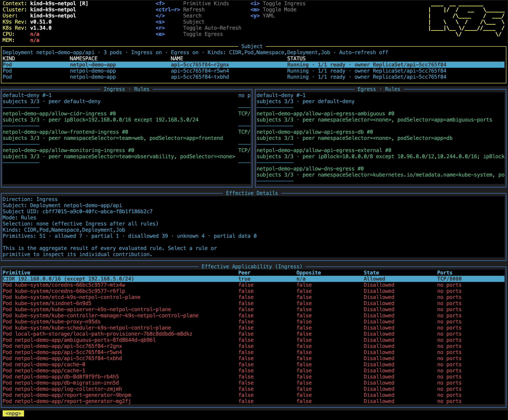
## 1. What Is Network Policy Graph?

Network Policy Graph is a read-only reachability view for Kubernetes
`NetworkPolicy`, Cilium `CiliumNetworkPolicy` and
`CiliumClusterwideNetworkPolicy`, and Istio `AuthorizationPolicy` resources. It
explains how those policies affect traffic to and from a selected workload,
called the **subject**.

NPG is intended to answer questions such as:

- Which ingress sources can reach this workload?
- Which egress destinations can this workload reach?
- Which NetworkPolicy rule contributes to an allow decision?
- Does the policy on the other endpoint also permit the traffic?
- Which ports and protocols remain after both endpoints are evaluated?
- Is a result fully allowed, fully disallowed, only partially allowed, unknown,
  or based on incomplete data?

NPG evaluates concrete pod-to-pod paths. For a path to be allowed:

1. The source pod's egress policy must allow it.
2. The destination pod's ingress policy must allow it.
3. The two sides must allow at least one common protocol and destination port.

Kubernetes NetworkPolicy rules are additive allow rules. Cilium and Istio
policies can also contribute explicit deny rules, which take precedence over
matching allows.

When native `policyTypes` is omitted, Kubernetes defaults it to `Ingress`,
adding `Egress` only when there is at least one egress rule. An empty
`egress: []` therefore requires explicit `policyTypes: [Egress]` to isolate
egress. Label-selector requirements are conjunctive, including Cilium
`any:` and `k8s:` requirements that refer to the same Kubernetes label.

NPG can be opened with:

```text
:netpolgraph <kind> <name> [namespace]
:npgraph <kind> <name> [namespace]
:npg <kind> <name> [namespace]
```

Supported subject kinds are `Pod`, `Deployment`, `Job`, and `Namespace`. Common
aliases such as `po`, `deploy`, `jobs`, and `ns` are accepted. Examples:

```text
:npg pod api-7d8c9f default
:npg deployment api default
:npg job database-migration default
:npg namespace payments
```

The same panel can be opened from a selected Pod, Deployment, Job, or Namespace
by pressing `Shift-R`.

The panel does not edit, create, or delete policies. It evaluates the current
cluster snapshot and provides navigation to related resources and YAML. Opening
a resource leaves NPG and pushes the resource view onto the normal K9s
breadcrumb stack.

While NPG is active, the status row beneath the K9s logo shows the
NPG-specific `read-only graph` badge. The badge is removed when NPG stops; it
is not a global K9s status.

NPG evaluates reachability once when opened. Automatic refresh is disabled by
default. It can be enabled at a five-second interval with `r`.

NPG models the supported declarative policy fields, not guaranteed packet
delivery. CNI behavior, NAT, node-local traffic, cloud firewalls, and other
networking layers may change the real result.

#### Partial Data is scoped to the pairs it can affect

When NPG cannot evaluate part of a policy, it marks only the pod pairs that part
could change as `Partial Data`, and names the policy and rule in the pair's
warnings. Other results stay definitive, even in clusters that use Istio or
Cilium L7 features elsewhere:

- A **rule** NPG cannot model degrades a pair only when its policy selects the
  pair's source (egress) or destination (ingress) and the rule could match the
  peer. This covers Cilium L7, TLS, SNI, listener, and authentication
  constraints, Istio HTTP request conditions, `when` conditions, JWT request
  identities, forwarded-client IPs, and negative ports or CIDRs.
- A rule with **dynamic peers** could match any peer, so it degrades every pair
  of the pods its policy selects in that direction. This covers Cilium FQDNs,
  Services, CIDR groups, cloud-provider groups, `fromRequires`/`toRequires`,
  and endpoint selectors that use unsupported label sources.
- A policy whose **effect** is unknown degrades every pair of the pods it
  selects in its directions: Cilium policies that Cilium's own validation
  rejects (for example `toCIDR` combined with `toCIDRSet`, or an unknown entity)
  and Istio policies with an unsupported action. Istio `CUSTOM` rules degrade
  the requests they match, because an external provider may deny them.
- A policy whose **selection** is unknown, such as an undecodable resource, an
  unsupported `endpointSelector`, or Istio `targetRefs`, degrades every pair in
  its namespace, or in every namespace for a cluster-wide or mesh-root policy.
- Only failures to list a whole resource type (for example missing RBAC for
  pods or CiliumNetworkPolicies) make the entire snapshot partial.

Cilium host policies (`nodeSelector`) apply to nodes and are outside the pod
graph; NPG ignores them. Pods using `hostNetwork` get Cilium's host or
remote-node identity instead of a pod endpoint identity, so pairs between a
`hostNetwork` pod and a pod whose direction is governed by Cilium policies, and
all pairs of `hostNetwork` pods when host policies exist, are `Partial Data`.
Native NetworkPolicy behavior for `hostNetwork` pods is implementation defined
and is evaluated as written.

NPG follows Cilium's validation: a rule may use only one peer family, ICMP
blocks cannot be combined with `toPorts`, port `0` means every port of the
protocol, named ports are matched case-insensitively (Cilium lower-cases IANA
service names), `world-ipv4` and `world-ipv6` map to `0.0.0.0/0` and `::/0`,
and ICMP-only rules grant no TCP, UDP, or SCTP port. `enableDefaultDeny` only
affects a direction that has rules, as in Cilium. NPG assumes Cilium 1.16 or
later: peers selected only by `io.cilium.k8s.namespace.labels.*` are not limited
to the policy namespace. Cilium 1.15 and earlier limit them to the policy
namespace, so on those versions such rules may allow fewer peers than shown;
affected rules carry a note.

#### Istio authorization

Kubernetes and Cilium policies form the network layer. Istio authorization is a
second destination-ingress layer; both layers must permit a pod-to-pod path.
Consequently, a destination AuthorizationPolicy can restrict the subject's
egress results even though AuthorizationPolicy has no egress rules.
Istio `ALLOW` activates default deny for selected destinations and Istio
`DENY` overrides matching allows. `AUDIT` and dry-run policies do not enforce
reachability in the graph. AuthorizationPolicy is TCP/HTTP-scoped, so
network-layer UDP and SCTP permissions pass through unchanged.

AuthorizationPolicy only applies to workloads in the mesh. NPG treats a pod as
enrolled when it has an `istio-proxy` container (or native sidecar), the
`istio.io/dataplane-mode=ambient` label on the pod or its namespace, or the
`ambient.istio.io/redirection=enabled` annotation. `hostNetwork` pods,
`istio.io/dataplane-mode=none`, and `sidecar.istio.io/inject=false` opt out,
and pods without any enrollment signal are outside the mesh; authorization is
not applied to them. When the signals conflict, for example a
`sidecar.istio.io/status` annotation without an `istio-proxy` container, or a
namespace with sidecar injection enabled but a pod without a sidecar, enrollment
is unknown and the affected pairs are `Partial Data`. Pod-level
`sidecar.istio.io/inject=true` labels and annotations also signal expected
injection, not proof of an actual sidecar. When both are present, the label
takes precedence over the annotation, as in Istio's injector. Actual sidecar
and ambient enrollment signals are evaluated before injection expectations.

Certificate-derived source namespace, service-account, principal, and
trust-domain constraints are evaluated from workload metadata: enrolled sources
present `cluster.local/ns/<namespace>/sa/<service account>`, and sources
outside the mesh present no identity, so positive constraints never match them
and negative constraints never exclude them. The result is definitive, and the
rule carries a note that the approximation assumes mesh mTLS and the default
`cluster.local` trust domain. In sidecar mode, proxies only use mTLS for
destinations they know as mesh endpoints: requests addressed to a bare pod IP
that no Service selects are sent in plaintext and carry no identity, so
identity-based rules deny them even when the graph shows them allowed. Values follow Istio's matchers: exact, prefix
(`abc*`), suffix (`*abc`), and presence (`*`); a leading `*` always means a
suffix match, so `*abc*` matches only values ending in the literal `abc*`.
Only `namespaces` expand `*` anywhere, trust domains accept one `*` at any
position, and `serviceAccounts` do not support wildcards.

NPG resolves the mesh root namespace by reading only the istiod mesh
ConfigMaps (`istio`, or `istio-<revision>` for revisioned istiod Deployments)
with targeted GET requests, which needs `get` access to those ConfigMaps and no
cluster-wide ConfigMap list or watch. If the ConfigMaps cannot be read or
parsed, NPG uses Istio's `istio-system` default and shows a note instead of
marking the snapshot partial. If revisions report different root namespaces,
policies in those namespaces are `Partial Data`, because the proxies they
govern cannot be determined from Kubernetes objects.

## 2. Terminology

### Subject

The **subject** is the Kubernetes resource whose reachability is being
investigated.

| Subject kind | Pods evaluated by NPG |
|---|---|
| `Pod` | The selected pod. |
| `Deployment` | The deployment's current pods. |
| `Job` | The job's current pods. |
| `Namespace` | The pods in the selected namespace. |

Deployment, Job, and Namespace subjects are aggregates. Their result can
therefore include many pod pairs rather than a single connection.

### Subject kind and primitive kind

NPG uses the word **kind** in two related places:

- A **subject kind** identifies what is being investigated: Pod, Deployment,
  Job, or Namespace.
- A **primitive kind** identifies the peer-side result shown in direction and
  applicability panels: CIDR, Pod, Namespace, Deployment, or Job.

The primitive-kind filter is global to the NPG view. It affects both directions
and their applicability tables, but it does not change the subject.

### Primitive

A **primitive** is a peer-side reachability target or source:

| Primitive kind | Meaning |
|---|---|
| `CIDR` | An `ipBlock.cidr`, including any `except` ranges. |
| `Pod` | One concrete pod. |
| `Namespace` | A conservative aggregate of pods in a namespace. |
| `Deployment` | A conservative aggregate of the deployment's pods. |
| `Job` | A conservative aggregate of the job's pods. |

For aggregate primitives, `Allowed` means every evaluated concrete pod pair is
allowed. A mix of allowed and non-allowed pairs is `Partial`, not `Allowed`.

CIDR permissions must hold across the entire displayed range. An overlapping
explicit deny can make a CIDR result `Unknown`. In that case, the graph keeps
only port permissions guaranteed for the whole range, rather than implying
that the range is uniformly allowed or denied.

### Pod pair

A **pod pair** is one concrete source pod and destination pod combination.

- For ingress, the peer pod is the source and the subject pod is the
  destination.
- For egress, the subject pod is the source and the peer pod is the
  destination.

Pair counts are important for aggregate subjects and primitives. For example,
two subject pods evaluated against three peer pods can produce six pairs.

### Ingress

**Ingress** is traffic entering the subject. The subject is the destination and
the displayed primitive is the source.

An ingress rule:

- selects destination pods through the NetworkPolicy's `podSelector`;
- matches sources through the rule's `from` peers;
- allows the rule's destination ports.

End-to-end ingress reachability also requires the source pod's egress side to
allow compatible traffic.

### Egress

**Egress** is traffic leaving the subject. The subject is the source and the
displayed primitive is the destination.

An egress rule:

- selects source pods through the NetworkPolicy's `podSelector`;
- matches destinations through the rule's `to` peers;
- allows the rule's destination ports.

End-to-end egress reachability also requires the destination pod's ingress side
to allow compatible traffic.

### Policy rules

A policy rule is a Kubernetes or Cilium ingress/egress entry, or an Istio
authorization rule. NPG identifies a real rule by:

- policy type (`NetworkPolicy`, `CiliumNetworkPolicy`,
  `CiliumClusterwideNetworkPolicy`, or `AuthorizationPolicy`);
- policy namespace and name;
- allow, deny, or custom action;
- direction;
- zero-based rule index.

Cilium resources also include the spec entry in their stable rule identity.
Rule labels name the entry, for example `specs[1]`, when the resource has more
than one `spec`/`specs` entry, and name the action for deny and custom rules,
so an allow and a deny at the same index never share a label.

Native Kubernetes NetworkPolicy rules can match peers with:

- `podSelector`;
- `namespaceSelector`;
- both selectors, which form an intersection;
- `ipBlock`, including `except` ranges;
- an omitted peer list, which means all peers.

A `namespaceSelector` is matched against the namespace labels plus the
immutable `kubernetes.io/metadata.name` label. NPG adds that label itself, so
selectors on the namespace name also match namespaces whose Namespace object is
missing from the snapshot (for example because of RBAC), and an empty
`namespaceSelector: {}` matches such namespaces too. Earlier versions required
the Namespace object and never matched a missing one.

For native NetworkPolicy, an omitted port list allows all ports for the
protocols represented by the evaluation. Named ports are resolved against
destination pod container ports when possible. Ambiguous named ports are
reported as unknown rather than being treated as allowed.

Empty rules are API-specific. A native NetworkPolicy `{}` rule allows all peers
and ports. For Cilium policies, an omitted or empty direction list has no
effect, while `ingress: [{}]` or `egress: [{}]` does not itself allow traffic
and normally isolates that direction; `enableDefaultDeny` controls isolation.
Use explicit Cilium peers such as `fromEntities: [all]` or `toEntities: [all]`
for a blanket allow. Istio `ALLOW` also distinguishes absent or empty `rules`
(no allowed requests) from `rules: [{}]` (all requests, still intersected with
network permissions).

NPG can also display synthetic rules:

- **unrestricted**: no Kubernetes or Cilium policy isolates the pod in that
  direction;
- **default-deny**: a Kubernetes or Cilium policy isolates the pod, but no
  additive allow rule permits the evaluated peer and port;
- **authorization default-deny (TCP)**: an Istio `ALLOW` policy isolates TCP
  ingress to a mesh pod, but no authorization rule permits the request. UDP and
  SCTP are not affected, so this row can appear next to an `unrestricted` row.

Synthetic rules explain evaluated behavior but do not correspond to a
Kubernetes object.

### Peer

In the Kubernetes API, a **peer** is the opposite endpoint matched by a rule's
`from` or `to` entry.

In the NPG applicability table, **Peer** is an NPG-specific boolean:

- `true` means the selected rule, or at least one rule in the current direction
  for an effective table, matched the primitive for at least one concrete pair;
- `false` means no such current-direction peer match was found;
- `n/a` means no concrete pair existed, so peer matching was not evaluated.

`Peer=true` does not by itself mean that traffic is allowed. The opposite
endpoint and port intersection must also permit the traffic.

### Opposite

**Opposite** is an NPG-specific concept; it is not a Kubernetes NetworkPolicy
field.

- For an ingress row, the opposite side is the source pod's egress policy.
- For an egress row, the opposite side is the destination pod's ingress policy.

The applicability table aggregates this check conservatively:

- `true` means all concrete pairs represented by the row are effective through
  the selected/current-direction match and the opposite endpoint permits
  compatible traffic;
- `false` means at least one pair lacks a required match, opposite-side allow,
  or common protocol/port;
- `n/a` is shown for CIDRs because an address range is not modeled as a pod with
  an opposite NetworkPolicy side;
- `n/a` is also shown when no concrete pair exists.

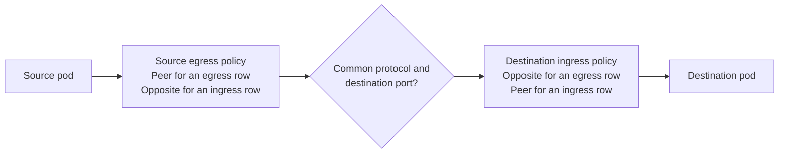
```mermaid
flowchart LR
    S[Source pod] --> E["Source egress policy<br/>Peer for an egress row<br/>Opposite for an ingress row"]
    E --> P{"Common protocol and<br/>destination port?"}
    P --> I["Destination ingress policy<br/>Opposite for an egress row<br/>Peer for an ingress row"]
    I --> D[Destination pod]
```

Always interpret `Peer`, `Opposite`, and `State` together. For example,
`Peer=true`, `Opposite=false`, and `State=Disallowed` means that the selected
side matched, but the complete end-to-end path was not allowed.

### Permissions and ports

Displayed permissions use values such as:

- `TCP/all`, `UDP/all`, or `SCTP/all`;
- `TCP/443`;
- `TCP/8000-8100`;
- `TCP/http` for a named port that has not been resolved in that context;
- `unknown` when the exact port cannot be safely determined;
- `no ports` when there is no effective permission;
- `n/a` when no concrete pair was evaluated.

For pod-to-pod traffic, effective permissions are the intersection of the
source egress and destination ingress permissions.

## 3. Panels

NPG initially shows the Subject panel, both direction panels, and the Details
area. Both directions initially use Rules mode, all primitive kinds are
enabled, and focus starts on Subject. Neither direction has a selected rule or
primitive in either projection. The active Details area therefore starts on
Effective Details with `Effective Applicability (Ingress)`. Changing the
subject, whether through the picker or `Ctrl-S`, clears both directions in both
projections and returns focus to Subject for the new evaluation.

### Subject panel
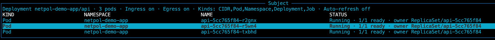
The Subject panel identifies the selected subject and lists associated
workloads.

Its summary line contains:

- subject kind and namespace/name;
- number of subject pods;
- whether ingress and egress are visible;
- enabled primitive kinds;
- auto-refresh state;
- truncation, partial-data, loading, and error messages when present.

The workload table is sorted by namespace and name and is limited to 300 rows.
Pod, Deployment, and Job subjects list their resolved pods. Namespace subjects
can list Deployments, ReplicaSets, StatefulSets, DaemonSets, Jobs, and Pods.

| Column | Meaning | Possible values |
|---|---|---|
| `KIND` | Workload resource kind. | `Pod`, `Deployment`, `ReplicaSet`, `StatefulSet`, `DaemonSet`, or `Job`. |
| `NAMESPACE` | Namespace containing the workload. | A Kubernetes namespace name. |
| `NAME` | Workload resource name. | A Kubernetes resource name. |
| `STATUS` | Compact workload-specific status. | Pod phase and readiness, owner information, ready/desired replicas, job condition, or completed count. |

Press `y` while a workload row is selected to open that workload's YAML.

### Ingress and Egress panels

Ingress and Egress use the same layout and behavior but represent opposite
traffic directions. Press `m` to switch both panels between Rules and
Primitives mode. The mode is always shared, while filters, selections, and
scroll positions are preserved independently for each direction and mode.
All four direction/projection selection states begin cleared.

The panel title shows:

```text
<Direction> · <Rules|Primitives> · filter: <text>
```

The filter suffix is shown only when that direction and mode has an active text
filter.

#### Rules mode
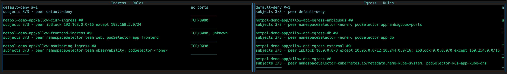
Rules are rendered as two-line blocks without a header.

| Displayed field | Meaning | Possible values |
|---|---|---|
| Rule identity | Policy namespace/name, the Cilium spec entry for multi-spec resources, the action for deny and custom rules, and the zero-based rule index. Synthetic rows use their synthetic name and index `-1`. | `payments/allow-api #0`, `payments/cnp specs[1] deny #0`, `default-deny #-1`, `authorization default-deny (TCP) #-1`, `unrestricted #-1`. |
| Type | API policy type supplying the rule. | `NetworkPolicy`, `CiliumNetworkPolicy`, `CiliumClusterwideNetworkPolicy`, `AuthorizationPolicy`, or `Synthetic`. |
| Ports | Permissions contributed by the rule. | Protocol/all, numeric ports, ranges, named or unknown ports, or `no ports`. |
| `subjects matched/selected` | Number of subject pods for which the rule contributed evidence divided by the subject pods selected by the policy for that direction. Ingress subjects are destinations; egress subjects are sources. | For example, `subjects 2/3`. |
| `peer` | Compact summary of the opposite endpoint matched by the rule. For ingress the peer is a source; for egress it is a destination. | `all peers`, selector text, CIDR text, `default-deny`, or `unrestricted`. |

Rules do not use a separate visible state column. The row color carries the
state, and the full state is shown in Rule Details.

| Rule state | Meaning |
|---|---|
| `Allowed` | The rule matched all subject pods selected by that rule. |
| `Partial` | The rule matched some, but not all, selected subject pods. |
| `Partial Data` | The rule carries warnings: part of it could not be evaluated, so the pairs it can affect are Partial Data. |
| `[EMPTY]` | No subject pod was available or no selected subject pod matched the rule. Non-synthetic empty rules are hidden; synthetic explanation rows remain visible. |

Synthetic rows use the normal foreground color instead of an allow/deny color
because they are explanations, not real policy rules.

When a real rule is selected and the direction panel has focus:

- `o` opens the Kubernetes, Cilium, or Istio policy resource; custom resources
  are opened by their fully qualified name, such as
  `authorizationpolicies.security.istio.io`, so another CRD with the same
  plural (for example Linkerd's `authorizationpolicies.policy.linkerd.io`)
  cannot be opened by mistake;
- `y` opens its YAML.

These actions are unavailable for synthetic rules.

#### Primitives mode
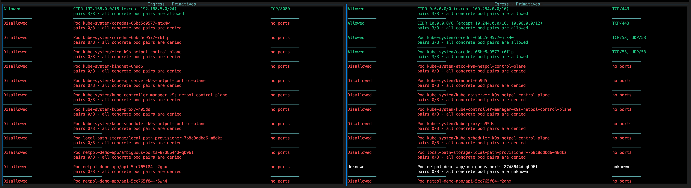
Primitives are rendered as two-line blocks with three columns.

| Column or field | Meaning | Possible values |
|---|---|---|
| State | Aggregate reachability state. | `Allowed`, `Disallowed`, `[PARTIAL allowed/total]`, `Unknown`, or `Partial Data`. |
| Primitive | Primitive kind and identity. | CIDR, Pod, Namespace, Deployment, or Job plus its name or CIDR. |
| Ports | Effective protocol and destination-port permissions. | Protocol/all, numeric ports, ranges, named or unknown ports, or `no ports`. |
| `pairs allowed/total` | Number of definitely allowed concrete pairs divided by all evaluated pairs. | For example, `pairs 3/4`. |
| Explanation | Reason for the aggregate state. | Examples include all pairs allowed, no matching allow rule, no concrete pairs, or incomplete data. |

Primitive states mean:

| State | Meaning |
|---|---|
| `Allowed` | Every concrete pair is allowed. |
| `Disallowed` | Every concrete pair is disallowed. |
| `Partial` | The result is mixed; at least one pair is allowed and at least one is not definitely allowed. |
| `Unknown` | No definitive allow/deny result can be produced. This commonly occurs when there are no current pods to form a pair, or every pair depends on unresolved semantics such as an ambiguous named port. |
| `Partial Data` | At least one evaluated pair depends on policy data NPG cannot evaluate, or the snapshot itself is incomplete, so the displayed observations must not be treated as a complete result. The warnings name the policies and rules involved. |

Press `Enter` to move from the direction panel to Primitive Details. Press `o`
from the direction panel or Primitive Details to open the selected Pod,
Namespace, Deployment, or Job in its native k9s view. `Enter` from Primitive
Details retains the same open behavior. CIDRs are address ranges rather than
Kubernetes resources and cannot be opened.

### Details panel
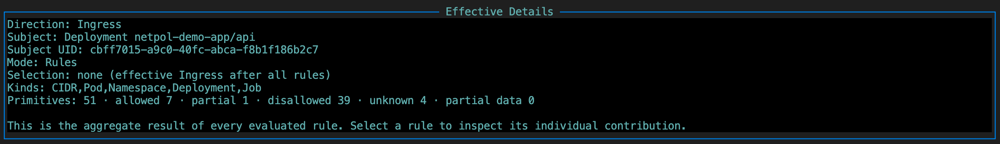
The Details panel follows the active direction and current selection.

#### Rule Details
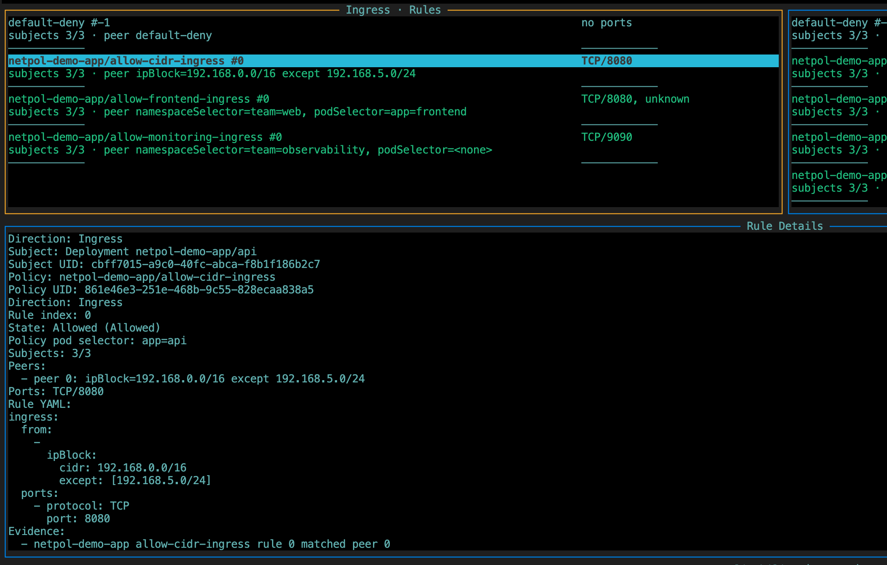
When a rule is selected in Rules mode, Rule Details contains:

- direction and subject identity;
- policy type, namespace, name, API version, UID, and allow/deny/custom
  action;
- zero-based rule index, followed for Cilium rules by the spec entry and its
  index, for example `Rule index: 0 in specs[1] (spec index 1)`;
- rule state;
- policy pod selector;
- matched/selected subject counts;
- each peer selector or IP block;
- ports;
- rendered rule YAML;
- notes about conservatively approximated semantics;
- contributing evidence;
- warnings.

An Applicability panel is displayed below the rule text.

#### Primitive Details
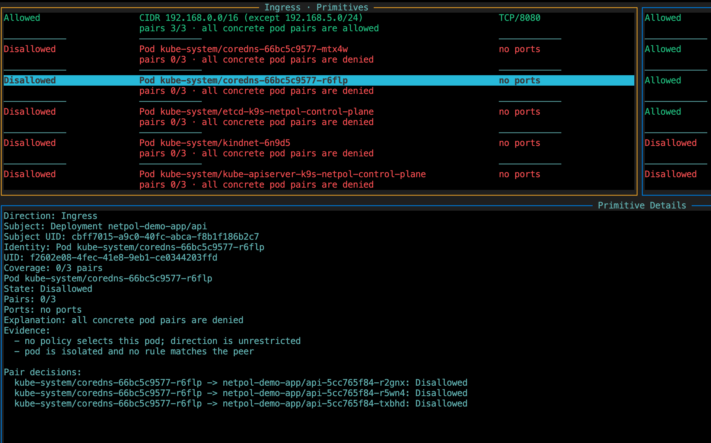
When a primitive is selected in Primitives mode, Primitive Details contains:

- direction and subject identity;
- primitive kind, identity, and UID where applicable;
- state;
- allowed/total pair coverage;
- effective ports;
- explanation;
- policy evidence;
- warnings;
- individual source-to-destination pair decisions.

A selected primitive has no per-rule applicability table.

#### Effective Details
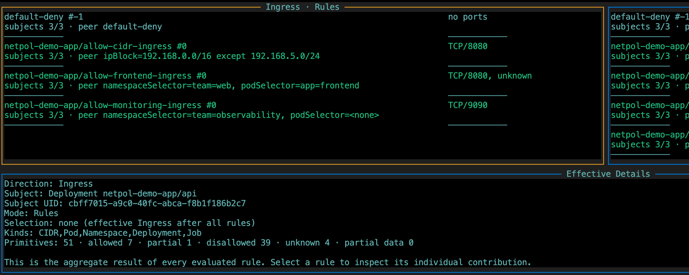
Effective Details is the default on launch and after every subject change.
Pressing `Esc` to clear a later direction selection returns to it. This is the
final reachability of every enabled primitive after all rules have been
combined, rather than one selected rule's contribution.

Effective Details shows:

- direction;
- current Rules or Primitives mode;
- `Selection: none`;
- enabled primitive kinds;
- total primitive count;
- counts for Allowed, Partial, Disallowed, Unknown, and Partial Data.

The state counts always add up to the displayed primitive total. Effective
Applicability is shown below the text when applicable.

### Applicability panel
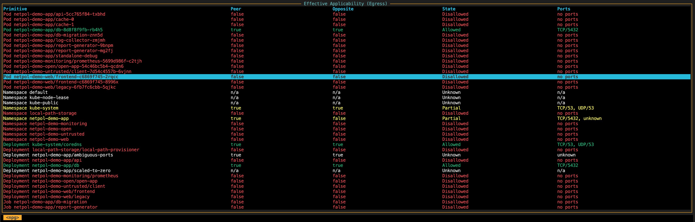
Applicability explains how a selected rule contributes to each enabled
primitive. When no direction row is selected, **Effective Applicability**
instead shows the final result after all rules have been applied.

| Column | Meaning | Possible values |
|---|---|---|
| `Primitive` | Peer-side primitive being evaluated. | CIDR, Pod, Namespace, Deployment, or Job. |
| `Peer` | Whether the current-direction rule or effective rule set matched the primitive. | `true`, `false`, or `n/a`. |
| `Opposite` | Whether all represented paths also pass the opposite endpoint's policy and compatible-port check. | `true`, `false`, or `n/a`. CIDRs always use `n/a`. |
| `State` | End-to-end applicability state for the row. | `Allowed`, `Disallowed`, `Partial`, `Unknown`, or `Partial Data`. |
| `Ports` | Effective common protocol and destination ports. | Protocol/all, numbers, ranges, `unknown`, `no ports`, or `n/a`. |

For a selected rule, State is derived conservatively:

- `Allowed`: every concrete pair matched the selected rule and is effective
  end to end;
- `Partial`: at least one concrete pair is effective through the rule, but not
  every pair;
- `Disallowed`: no concrete pair is definitely effective through the selected
  rule;
- `Unknown`: no concrete pod pair exists, so the rule's effect cannot be
  evaluated;
- `Partial Data`: at least one of the primitive's pairs depends on policy
  data NPG cannot evaluate, or the primitive was evaluated from incomplete or
  truncated data.

For Effective Applicability, State is the primitive's final aggregate state
after all current-direction and opposite-direction rules are combined.

An `Unknown` row is not the same as a denied row. For example, a Deployment
primitive with no current pods produces zero concrete pairs. Because no peer
selector, opposite endpoint, or port intersection was actually tested, the row
uses:

```text
Peer: n/a
Opposite: n/a
State: Unknown
Ports: n/a
```

Effective applicability can also be `Unknown` when concrete pairs exist but
all of their decisions are unknown, such as when a named destination port is
ambiguous. `Partial Data` is different: it means the evaluator knows its input
is incomplete for that row, for example because a policy that selects one of the
pods has a rule NPG cannot evaluate, Istio mesh enrollment is unknown, missing
RBAC access or a failed resource list/watch, or result truncation. Effective
Details lists the warnings that affected the subject; assumptions that do not
make results partial, such as a mesh-config fallback, appear as `Note:` lines
and do not count toward the `PARTIAL DATA` badge.

The panel uses the globally enabled primitive kinds. Pressing `p` can therefore
add or remove rows from both the direction panels and applicability tables.
Pressing `a` in Rules mode toggles both ingress and egress rule/effective
applicability tables between all rows and exact Allowed rows only. Disallowed,
Partial, Unknown, and Partial Data rows are hidden. The Allowed-only setting
persists across projection changes and applies again when returning to Rules.
While active, applicability titles append a second parenthesized suffix
`(Allowed only)`, for example `Applicability (Ingress) (Allowed only)`.
Allowed-only affects only the visible applicability rows. Effective Details
continues to report the complete Allowed, Partial, Disallowed, Unknown, and
Partial Data counts, and those counts still sum to the unfiltered primitive
total.

## 4. Navigation and Shortcuts

### Opening NPG

| Key or command | Action |
|---|---|
| `Shift-R` | Open NPG for the selected Pod, Deployment, Job, or Namespace in its normal resource view. |
| `:npg ...` | Open NPG for an explicitly named subject. |
| `:npgraph ...` | Alias for `:npg`. |
| `:netpolgraph ...` | Alias for `:npg`. |

### Focus navigation

`Tab` moves forward and `Shift-Tab` moves backward through the focus ring.
With both directions visible, a selected rule, and applicability rows present,
the complete ring is:

```text
Subject
  -> Ingress
  -> Ingress Details
  -> Ingress Applicability
  -> Egress
  -> Egress Details
  -> Egress Applicability
  -> Subject
```

The reverse order is used by `Shift-Tab`.

The ring is dynamic:

- a hidden direction and all of its stops are omitted;
- a selected primitive has Details but no Applicability stop;
- a cleared selection can have Effective Details and Effective Applicability
  in either mode;
- an empty applicability table is omitted;
- with both directions hidden, only Subject remains in the ring.

Each direction owns the Details and Applicability stops immediately following
it. This lets `Tab` reach ingress applicability without first moving through
the egress panel.

| Key | Action |
|---|---|
| `Tab` | Move to the next Subject, direction, Details, or Applicability stop. |
| `Shift-Tab` | Move to the previous focus stop. |
| `Left` | Focus Ingress while focus is outside Details/Applicability. Inside Details/Applicability, the key is passed to the focused widget for scrolling. |
| `Right` | Focus Egress while focus is outside Details/Applicability. Inside Details/Applicability, the key is passed to the focused widget for scrolling. |

### Row navigation

The focused table supports:

| Key | Action |
|---|---|
| `Up` / `Down` | Select the previous or next workload, rule, primitive, or applicability row. |
| `PageUp` / `PageDown` | Move by one visible page. |
| `Home` / `End` | Move to the first or last row. |

After `Esc` clears a direction selection, pressing an arrow or paging key in
that direction panel restores a selection.

### Enter behavior

`Enter` is focus-sensitive:

| Current focus | `Enter` action |
|---|---|
| Subject | Move to the active visible direction, initially Ingress. |
| Ingress or Egress with a selected rule | Move directly to that rule's Applicability table when it has rows; otherwise move to Rule Details. |
| Ingress or Egress with no selection | Move to Effective Applicability when it has rows; otherwise move to Effective Details. |
| Ingress or Egress with a selected primitive | Move to Primitive Details. |
| Applicability or Effective Applicability | Remain in the applicability table. Use `o` to open the highlighted Kubernetes primitive. |
| Rule Details | No action. |
| Primitive Details | Open the selected Pod, Namespace, Deployment, or Job primitive. A CIDR reports that it is not a Kubernetes resource. |

`Ctrl-S` (**Set As Subject**) promotes the highlighted resource to the current subject and
reevaluates:

- In Rules-mode Applicability or Effective Applicability, Pod, Namespace,
  Deployment, and Job primitives are eligible; CIDRs are not.
- In Subject, selected Pod, Deployment, and Job workload rows are eligible.
  ReplicaSet, StatefulSet, and DaemonSet rows are not supported subject kinds.

The new subject begins with both directions and both projections cleared, and
focus returns to Subject. Plain `Enter` never promotes the subject.

### Open Primitive behavior

When the focused selection maps to a native Kubernetes resource, the header
shows `<o> Open Primitive`. Press `o` to open that resource in its native k9s
view from:

- Subject;
- Ingress or Egress in Rules or Primitives mode;
- Applicability or Effective Applicability;
- Primitive Details.

In Rules mode, a real direction-row selection opens its NetworkPolicy.
`o` is hidden and unbound in Rule Details and whenever the selection is empty,
synthetic, unavailable, or a CIDR.

### Escape behavior

`Esc` has a two-stage behavior for an active ingress or egress selection:

1. The first `Esc` clears that direction's selection and shows Effective
   Details and Effective Applicability.
2. With no direction selection to clear, `Esc` performs normal back navigation.

`Esc` also cancels NPG dialogs. After opening a resource or YAML view from NPG,
`Esc` returns through the normal breadcrumb stack.

### Complete NPG key map

| Key | Action |
|---|---|
| `i` | Show or hide the Ingress panel. |
| `e` | Show or hide the Egress panel. |
| `m` | Toggle both direction panels between Rules and Primitives mode. |
| `s` | Open the subject picker. |
| `p` | Open the global primitive-kind selector for CIDR, Pod, Namespace, Deployment, and Job. |
| `a` | Toggle both ingress and egress rule/effective applicability tables between all rows and exact Allowed rows only. Available only in Rules mode; hidden/unbound in Primitives mode. |
| `/` | Search/filter the focused Subject, direction, Rule/Primitive context, or Applicability panel. Hidden while Effective Details text has focus. |
| `r` | Enable or disable automatic reevaluation every five seconds. |
| `o` | **Open Primitive**: open the selected native Kubernetes resource from Subject, Ingress, Egress, Applicability, Effective Applicability, or Primitive Details. Hidden in Rule Details and for CIDRs, synthetic rows, or empty selections. |
| `y` | Open YAML for the focused selected workload, real rule, resource primitive, or applicability row. Unavailable for CIDRs, synthetic rules, and empty selections. |
| `Enter` | Move from Subject or a direction panel into the graph's next focus stop. It is inert in Applicability and Rule Details, and retains open behavior in Primitive Details. |
| `Ctrl-S` | **Set As Subject**: promote an eligible highlighted Pod, Deployment, Job, or Namespace applicability primitive—or Pod, Deployment, or Job Subject workload row—to the current subject and reevaluate. |
| `Esc` | Clear the active direction selection first; otherwise cancel or go back. |
| `Left` / `Right` | Focus Ingress/Egress, except when a Details widget owns the arrows for scrolling. |
| `Tab` / `Shift-Tab` | Move forward/backward through the panel focus ring. |
| `Up` / `Down` | Move the focused table selection. |
| `PageUp` / `PageDown` | Move the focused table selection by a page. |
| `Home` / `End` | Move to the first/last row. |

If both directions are hidden, the middle area displays:

```text
Both directions are hidden. Press i for ingress or e for egress.
```

### Dialog navigation

The Subject picker opened with `s` supports:
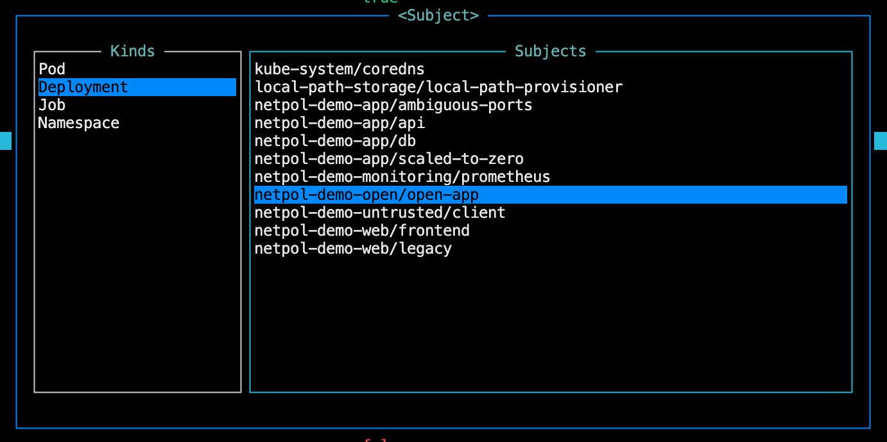
| Key | Action |
|---|---|
| `Left` / `Right` | Switch between the subject-kind list and resource-instance list. |
| `Tab` | Switch between the two lists. |
| `Up` / `Down` | Move in the active list. |
| `Enter` | Accept the selected subject. |
| `Esc` | Cancel without changing the subject. |
<br>
---
<br>

The Primitive Kinds dialog opened with `p` supports standard form navigation:
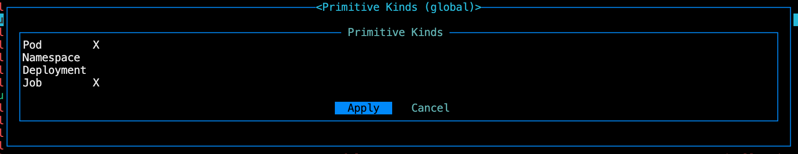

The dialog is sized so all five kind checkboxes and the Apply/Cancel buttons
remain visible together on normal terminal sizes, and it is clamped safely to
the available space on smaller terminals.

| Key | Action |
|---|---|
| `Tab` / `Shift-Tab` | Move between kind checkboxes and Apply/Cancel buttons. |
| `Space` | Toggle the focused primitive kind. |
| `Enter` | Activate the focused control. |
| `Esc` | Cancel without applying changes. |
<br>
---
<br>

The Search dialog opened with `/` contains Apply, Clear, and Cancel actions.
Its target follows focus:
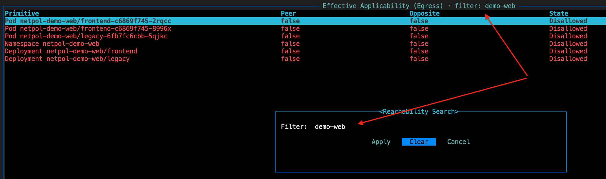
- Subject filters the subject workload rows.
- Ingress or Egress filters that direction in the current projection.
- Rule Details and Applicability filter the current direction's applicability
  rows.
- Primitive Details filters the current direction's Primitives panel.
- Effective Applicability can be filtered, but Search is hidden while Effective
  Details text has focus.

Applicability search matches the values currently displayed in every column.
This includes `n/a` for unevaluated Peer, Opposite, and Ports values, rather
than the internal boolean or empty values behind those cells.

Subject, direction, and applicability filters retain independent state. `Esc`
cancels the dialog and returns focus to the panel that opened it.
